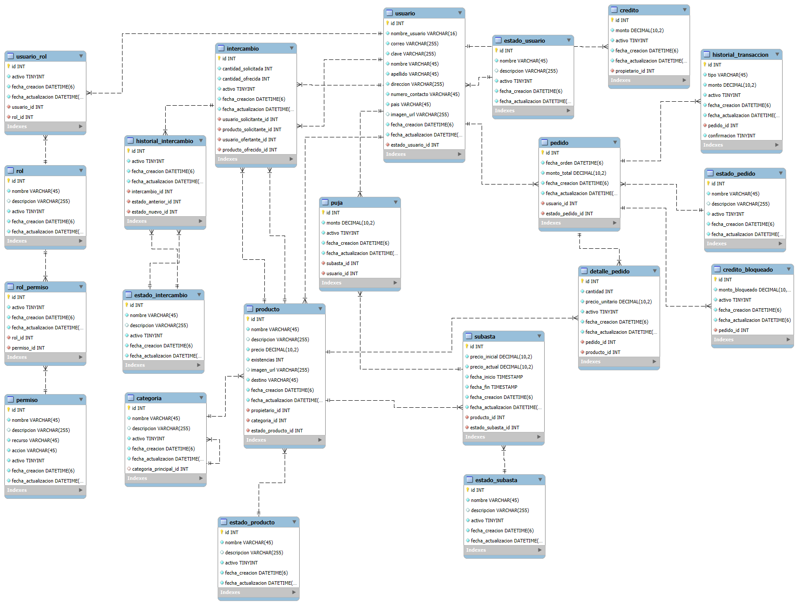

# AUREX_CRUD
:heavy_check_mark: Check: Repositorio api CRUD para AUREX.

## Especificaciones Tecnicas

### Tecnologías implementadas

<p align="center">
  <a href="http://nestjs.com/" target="blank"></a>
</p>

<p align="Center">Nest.js</p>

### Variables de entorno
```bash
# API parametros
AUREX_CRUD_HTTP_PORT=[Puerto expuesto para el API]
# Parameters de base de datos
DB_HOST=[URL, Dominio o endpoint de base de datos]
DB_PORT=[Puerto de base de datos]
DB_USERNAME=[Usuario de base de datos]
DB_PASSWORD=[Contraseña de usuario de base de datos]
DB_DATABASE=[Nombre de base de datos]
```

## Compilación y ejecución del proyecto

```bash
# Pruebas
$ npm run start

# Desarrollo
$ npm run start:dev

# Modo producción
$ npm run start:prod
```
## Modelo de datos



## Despliegue

Actualmente el sistema se encuentra conectado con el entorno de Azure, de tal forma que cualquier cambio que se suba en la rama de develop, este se sincronizará automáticamente con los archivos en Azure, de manera que en Github Actions, podremos ver el proceso de despliegue de dichos cambios.

## Recursos

Check out a few resources that may come in handy when working with NestJS:

- Visit the [NestJS Documentation](https://docs.nestjs.com) to learn more about the framework.