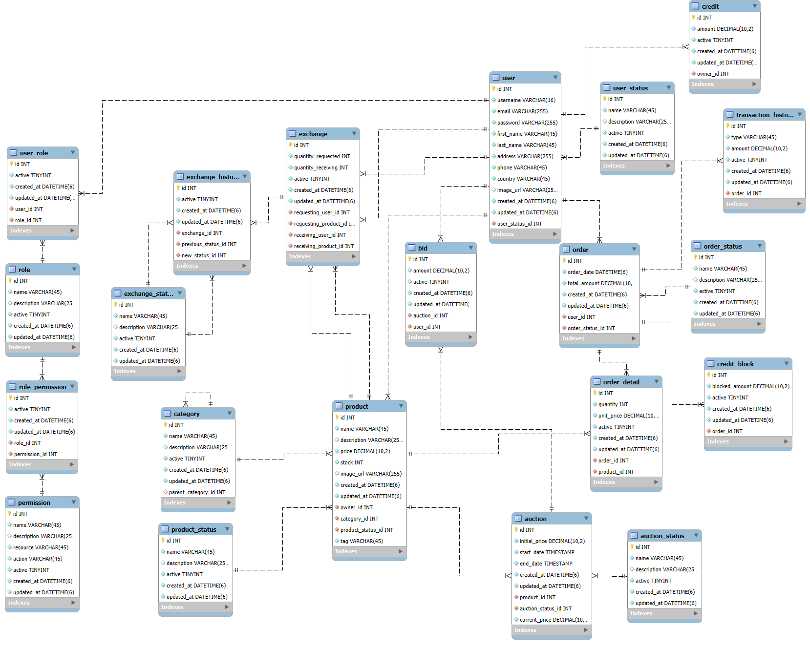

# aurex_CRUD
:heavy_check_mark: Check: Repository api CRUD for AUREX.

## Technical Specifications

### Implemented technologies

<p align="center">
  <a href="http://nestjs.com/" target="blank"></a>
</p>

<p align="Center">Nest.js</p>

### Environment variables
```bash
# API parameters
HTTP_PORT=[API exposure port]
# Parameters of database
DB_HOST=[URL, Domain or DB EndPoint]
DB_PORT=[DB Port]
DB_USERNAME=[DB User]
DB_PASSWORD=[DB user password]
DB_DATABASE=[Database name]
```

## Compile and run the project

```bash
# development
$ npm run start

# watch mode
$ npm run start:dev

# production mode
$ npm run start:prod
```
## Data model



## Deployment

When you're ready to deploy your NestJS application to production, there are some key steps you can take to ensure it runs as efficiently as possible. Check out the [deployment documentation](https://docs.nestjs.com/deployment) for more information.

If you are looking for a cloud-based platform to deploy your NestJS application, check out [Mau](https://mau.nestjs.com), our official platform for deploying NestJS applications on AWS. Mau makes deployment straightforward and fast, requiring just a few simple steps:

```bash
$ npm install -g mau
$ mau deploy
```

With Mau, you can deploy your application in just a few clicks, allowing you to focus on building features rather than managing infrastructure.

## Resources

Check out a few resources that may come in handy when working with NestJS:

- Visit the [NestJS Documentation](https://docs.nestjs.com) to learn more about the framework.